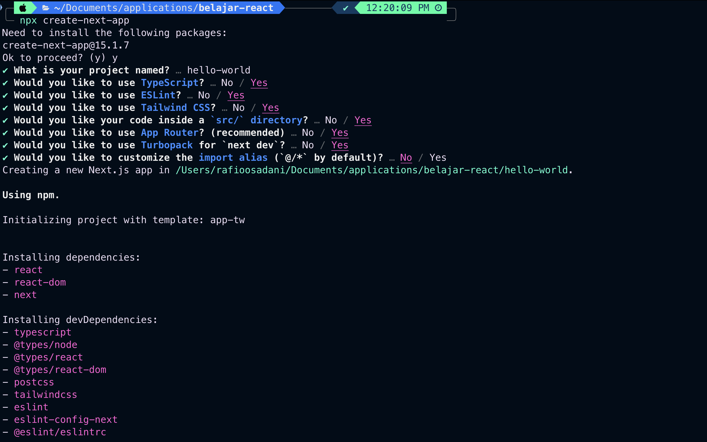
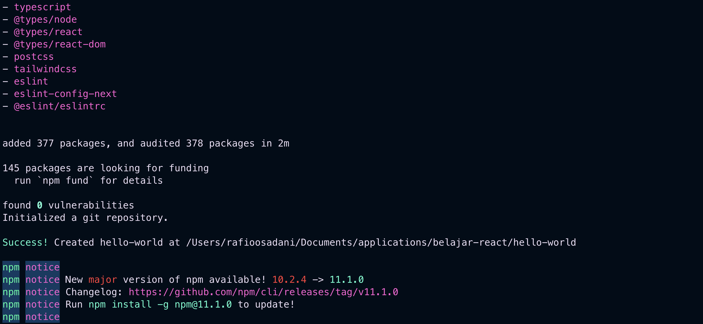
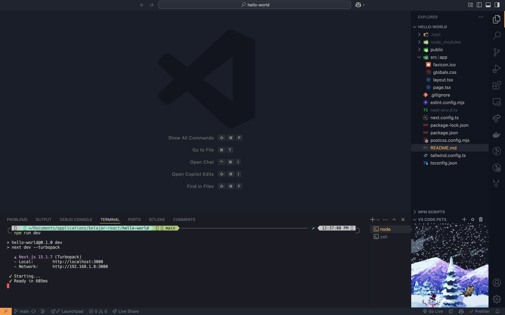
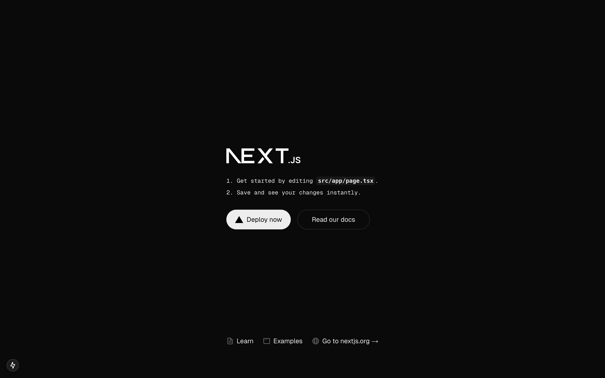
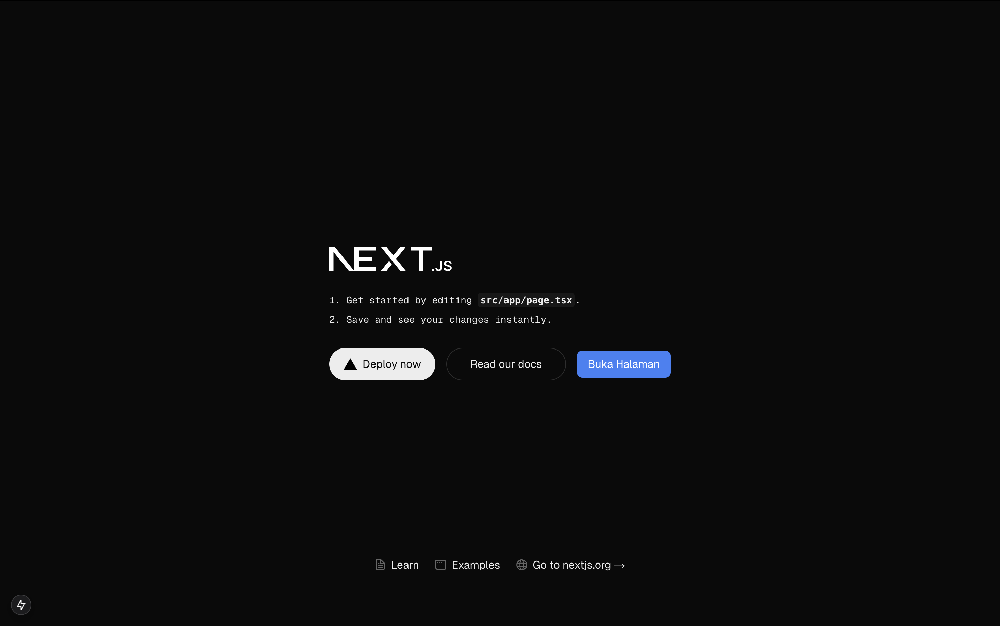
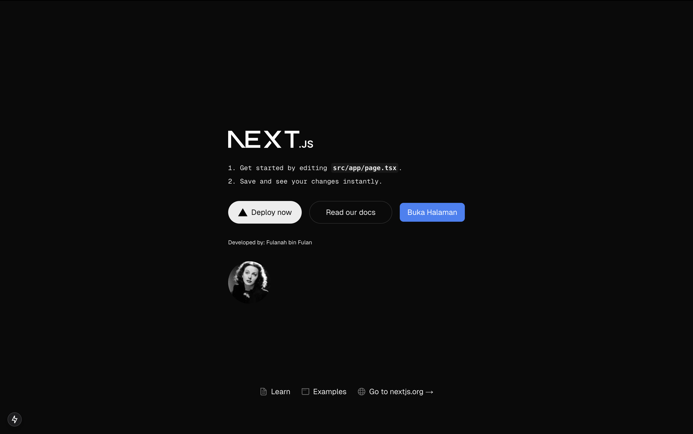

## Laporan Praktikum

|           | Pem. Berbasis Framework 2025 |
| --------- | ---------------------------- |
| **NIM**   | 244107027004                 |
| **Nama**  | Rafio Sadani                 |
| **Kelas** | TI - 4K                      |

## Pertanyaan Praktikum 1

1. Jelaskan kegunaan masing-masing dari Git, VS Code dan NodeJS yang telah Anda install pada sesi praktikum ini!

2. Buktikan dengan screenshoot yang menunjukkan bahwa masing-masing tools tersebut telah berhasil terinstall di perangkat Anda!

## Jawaban Praktikum 1

1. Kegunaan dari Git, VS Code, dan NodeJS

   - **Git** adalah sistem kontrol versi yang digunakan untuk melacak perubahan kode, memfasilitasi kolaborasi tim, dan mengelola repositori dengan aman.
   - **VS Code** adalah editor kode yang ringan namun powerful, mendukung berbagai bahasa pemrograman, debugging, dan integrasi dengan Git untuk pengembangan yang efisien.
   - **Node.js** adalah runtime JavaScript yang memungkinkan eksekusi kode di luar browser, digunakan untuk membangun backend, API, dan mengelola dependensi melalui npm.

2. Bukti tools telah berhasil terinstal di komputer.
   

   Tampilan Aplikasi VSCode
   

---

## Pertanyaan Praktikum 2

1. Pada Langkah ke-2, setelah membuat proyek baru menggunakan Next.js, terdapat beberapa
   istilah yang muncul. Jelaskan istilah tersebut, TypeScript, ESLint, Tailwind CSS, App
   Router, Import alias, App router, dan Turbopack!

2. Apa saja kegunaak folder dan file yang ada pada struktur proyek React yang tampil pada
   gambar pada tahap percobaan ke-3!

3. Buktikan dengan screenshoot yang menunjukkan bahwa tahapan percobaan di atas telah
   berhasil Anda lakukan!

## Jawaban Praktikum 2

1. Penjelasan istilah-istilah tersebut dapat dilihat di tabel berikut.

   | Kata Kunci       | Penjelasan                                                                                                                                                                                                                                                           |
   | ---------------- | -------------------------------------------------------------------------------------------------------------------------------------------------------------------------------------------------------------------------------------------------------------------- |
   | **TypeScript**   | Superset dari JavaScript yang menambahkan sistem tipe statis. Ini membantu mendeteksi kesalahan sejak awal dalam proses pengembangan dan meningkatkan keterbacaan serta pemeliharaan kode.                                                                           |
   | **ESLint**       | Alat linting yang digunakan untuk memastikan kualitas kode dengan menerapkan aturan tertentu. Ini membantu mendeteksi bug, meningkatkan konsistensi kode, dan menghindari kesalahan sintaksis atau praktik buruk dalam JavaScript dan TypeScript.                    |
   | **Tailwind CSS** | Framework CSS berbasis utility-first yang memungkinkan pengembang membangun UI dengan cepat menggunakan kelas-kelas yang sudah tersedia tanpa perlu menulis banyak kode CSS kustom.                                                                                  |
   | **App Router**   | Sistem routing berbasis file di dalam folder `app/` dalam Next.js. Ini menggantikan sistem `pages/` lama dan mendukung fitur baru seperti Server Components, Layouts, dan Streaming untuk meningkatkan performa aplikasi.                                            |
   | **Import Alias** | Fitur yang memungkinkan pengembang menggunakan jalur impor yang lebih singkat dan mudah dibaca, misalnya `@/components/Button` dibandingkan dengan `../../components/Button`, dengan mendefinisikannya di file `tsconfig.json` atau `jsconfig.json`.                 |
   | **Turbopack**    | Bundler baru yang dikembangkan oleh Vercel sebagai pengganti Webpack untuk proyek Next.js. Dibangun dengan Rust, Turbopack menawarkan kecepatan kompilasi dan hot reload yang jauh lebih cepat dibandingkan Webpack, sehingga meningkatkan produktivitas pengembang. |

2. Berikut adalah kegunaan dari folder dan file utama dalam proyek Next.js:

   **📂 Folder**
   | Nama Folder | Kegunaan |
   |-------------|----------|
   | **/public** | Menyimpan file aset statis seperti gambar, ikon, dan font yang dapat diakses langsung oleh browser tanpa perlu diproses oleh Next.js. |
   | **/src** | Menyimpan seluruh kode sumber aplikasi, termasuk komponen, halaman, dan logika utama, serta memisahkannya dari file konfigurasi di root proyek. |
   | **/app** | Mengelola sistem routing aplikasi berbasis file dalam Next.js, memungkinkan navigasi halaman dalam single-page application dengan fitur bawaan seperti server components dan layouts. |

   **📄 File**
   | Nama File | Kegunaan |
   |---------------------|----------|
   | **.gitignore** | Menentukan file atau folder yang harus diabaikan oleh Git agar tidak masuk ke dalam repository. |
   | **eslint.config.ts** | Mengatur aturan dan konfigurasi linting untuk menjaga kualitas dan konsistensi kode dalam proyek. |
   | **next.config.ts** | File konfigurasi utama untuk Next.js, digunakan untuk mengatur berbagai fitur seperti optimasi, rewrites, dan custom headers. |
   | **package.json** | Menyimpan metadata proyek, daftar dependensi, script perintah, serta informasi lainnya yang digunakan oleh npm atau yarn. |
   | **postcss.config.mjs** | Mengatur konfigurasi PostCSS untuk pemrosesan CSS, seperti autoprefixing dan minifikasi. |
   | **tailwind.config.ts** | Mengelola konfigurasi Tailwind CSS, termasuk tema, skala responsif, dan kustomisasi utility classes. |
   | **tsconfig.json** | File konfigurasi TypeScript yang menentukan aturan transpiling kode, tipe data, serta pengaturan compiler untuk proyek. |

3. Bukti percobaan yang telah berhasil dilakukan.
     
     
     
   

---

## Pertanyaan Praktikum 3

Buktikan dengan screenshoot yang menunjukkan bahwa tahapan percobaan di atas telah berhasil Anda lakukan!

## Jawaban Praktikum 3

Bukti component `MyButton` berhasil ditambahkan.

---

## Pertanyaan Praktikum 4

1. Untuk apakah kegunaan sintaks user.imageUrl?
2. Buktikan dengan screenshoot yang menunjukkan bahwa tahapan percobaan di atas telah berhasil Anda lakukan!

## Jawaban Praktikum 4

1. Sintaks `user.imageUrl` digunakan untuk mengakses nilai atau sumber gambar yang disimpan dalam properti `imageUrl` pada objek `user`
2. Bukti component `Profile` berhasil ditambahkan.
   
